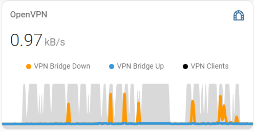

# OpenVPN 2 MQTT

OpenVPN is routinely used to securely access private Home-Assistant implementations, but there is no integration to monitor openVPN traffic with in HA.  So Here's How you can, relatively simply with this dockerizable python script.

The script monitors the OpenVPN status log file then publishes to a MQTT broker and Home-Assistant utilizing MQTT Discovery.



## Configuration

### Requirements
- MQTT Broker (for example, use the HA Mosquitto Addon )
- MQTT enabled in Home-Assistant (Add MQTT integration)
- You will need to know the location of the OpenVPN state log file. _The default location is `/etc/openvpn/<server>` folder. The location can be changed in the OpenVPN server configuration file, for example 'state /var/logs/openvpn/status.log`_
- 'root' access on the OpenVPN host maybe required to view the log file and install
- Clone this repository
```
cd ~
git clone https://github.com/wizmo2/ha-ovpn2mqtt.git
```

### Options
The following are available environment options used for both service and docker installs.  

|Parameter|Description|Default|
|-|-|-|
|OVPN2MQTT_NAME|sensor name|"openvpn"|
|OVPN2MQTT_UPDATE_TIME|refresh time in seconds|300|
|OVPN2MQTT_MQTT_HOST|broker host|"127.0.0.1"|
|OVPN2MQTT_MQTT_PORT|broker port|1883|
|OVPN2MQTT_MQTT_USER|broker username|""|
|OVPN2MQTT_MQTT_PASSWORD|broker user password|""|
|OVPN2MQTT_DEBUG|debug loglevel|False|
|OVPN2MQTT_LOGFILE|log file location|"/openvpn-status.log"|

## Docker Install
Creating a Docker container is the simplest implementation method.  Docker must be installed on the OpenVPN host system.  .

Build the docker
```
cd ~/ha-ovpn2mqtt
sudo docker build -t ha-ovpn2mqtt .
```

Run the docker.  _NOTE:  See [options](#options) for other configuration parameters_
```
sudo docker run -itd \
 --name ovpn2mqtt \
 --restart=unless-stopped \
 -v /var/log/openvpn-status.log:/openvpn-status.log \
 -e OVPN2MQTT_MQTT_HOST="192.168.1.1" 
   ha-ovpn2mqtt
 ```
 
_NOTE: Add `-e <parameter>=<value> \` to docker command as needed_

_NOTE: For debugging add `-v ~/ha-ovpn2mqtt/:/app/'_
 
## Service Install
_**Untested**_ 
Alternatively `openvpn2mqtt.py` can be run as a background service

Install requirements
```
cd ~/ha-ovpn2mqtt
pip install -r requirements.txt
```

Test the python script. _NOTE:  See  [options](#options)  for other configuration parameters_
```
OVPN2MQTT_NAME=Server2
OVPN2MQTT_LOGFILE=/var/log/openvpn/status.log
OVPN2MQTT_MQTT_HOST=192.168.1.1
python3 openvpn2mqtt.py
```

Create a new service file `sudo nano /etc/systemd/system/ovpn2mqtt.service`
add the following, for example 
```
[Unit]
Description=OpenVPN2MQTT
After=multi-user.target
[Service]
Type=simple
RestartSec = 30
Restart=always
Environment="OVPN2MQTT_NAME=Server2"
Environment="OVPN2MQTT_LOGFILE=/var/log/openvpn/status.log"
Environment="OVPN2MQTT_MQTT_HOST=192.168.2.1"
WorkingDirectory=/home/user/ha-ovpn2mqtt
ExecStart=/usr/bin/python3 /home/user/ha-ovpn2mqtt/openvpn2mqtt.py
[Install]
WantedBy=multi-user.target
```

Enable and start the service
```
sudo systemctl enable ovpn2mqtt
sudo systemctl start ovpn2mqtt
```
## Sensors
When correctly configured, An 'OpenVPN' device should be created with a 'Clients' sensor.  The 'Clients' sensor shows the number of active connections.  The sensor attributes include additional server information and all client data.

A 'Rate up' and 'Rate down' sensor is created for each detected client.  


 > ## TODO:
 > - Add telnet management support. _NOTE:  It is possible to retrieve the status log file remotely using telnet, but only one connection session is supported, plus telnet within python is depreciated._
 > - Correctly handle multiple connections using the same name
 
